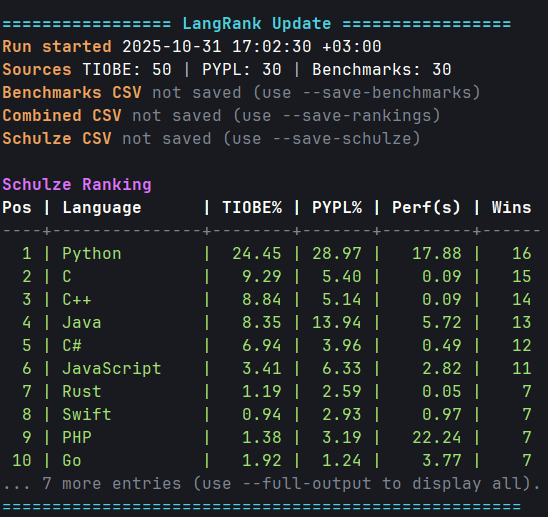

# 🌟 LangRank

LangRank — утилита на Rust, которая собирает свежие рейтинги популярности языков программирования (TIOBE, PYPL, Languish), объединяет их с данными Benchmarks Game и вычисляет итоговое ранжирование по методу Шульце.



<sup>🎨 Визуализация итогового рейтинга</sup>

## 📋 Содержание

- [📚 О проекте](#-о-проекте)
- [🛠️ Сборка и запуск](#️-сборка-и-запуск)
- [💾 Сохранение выгрузок](#-сохранение-выгрузок)
- [🧮 Алгоритм Шульце](#-алгоритм-шульце)
- [🤖 Автодополнение команд](#-автодополнение-команд)
- [🌐 Источники данных](#-источники-данных)
- [🧱 Статическая сборка](#-статическая-сборка)

## 📚 О проекте

Приложение ориентировано на быструю сверку разных метрик популярности языков. Оно:

1. Подтягивает сводки рейтингов [TIOBE](https://www.tiobe.com/tiobe-index/), [PYPL](https://pypl.github.io/PYPL.html) и [Languish](https://tjpalmer.github.io/languish/).
2. Нормализует названия языков и объединяет показатели.
3. Скачивает CSV Benchmarks Game и извлекает медианное время выполнения задач.
4. Строит итоговую таблицу по методу Шульце, учитывая популярность и производительность.

## 🛠️ Сборка и запуск

```bash
# Запуск с выводом топ-10 в терминале
cargo run --release

# Подробный вывод с полным Schulze-ранжированием
cargo run --release -- --full-output
```

## 💾 Сохранение выгрузок

Каждый флаг можно передать без пути — в этом случае используется значение по умолчанию.

```bash
# Сохраняем комбинированные рейтинги и Schulze-таблицу
cargo run --release -- \
  --save-rankings data/output/rankings.csv \
  --save-schulze

# Сохраняем CSV Benchmarks Game в кастомный путь
cargo run --release -- --save-benchmarks data/raw/alldata.csv
```

## 🧮 Алгоритм Шульце

LangRank строит четыре «бюллетеня» предпочтений: по позициям в TIOBE, PYPL, Languish и по скорости выполнения задач. Затем для каждого языка вычисляется количество побед над конкурентами в матрице сильнейших путей Шульце. При равенстве используется комбинированный счёт: доли рейтингов + обратная величина медианного времени.

## 🤖 Автодополнение команд

Утилита умеет генерировать скрипты автодополнения для популярных оболочек:

```bash
# Сгенерировать и установить автодополнение для Bash
cargo run -- completions bash --install

# Вывести скрипт для fish в stdout
cargo run -- completions fish
```

## 🌐 Источники данных

- 🔵 TIOBE Index — <https://www.tiobe.com/tiobe-index/>
- 🔶 PYPL Popularity Index — <https://pypl.github.io/PYPL.html>
- 🟢 Languish (Programming Language Trends) — <https://tjpalmer.github.io/languish/>
- 🟥 Benchmarks Game — <https://salsa.debian.org/benchmarksgame-team/benchmarksgame/-/raw/master/public/data/alldata.csv>

## 🧱 Статическая сборка

Для сборки статического бинарника под Linux/musl используйте скрипт:

```bash
./build_musl.sh
```

Он запускает официальный контейнер `clux/muslrust:nightly` и собирает релизную версию.
