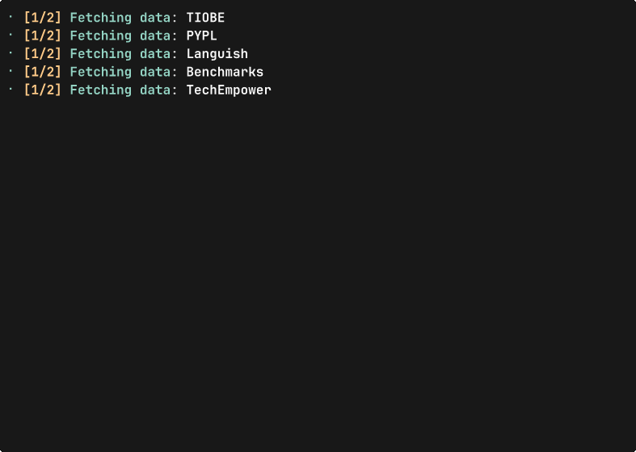

# 🌟 LangRank

[](https://github.com/hexqnt/langrank/actions/workflows/ci.yml)

LangRank — утилита на Rust, которая собирает свежие рейтинги популярности языков программирования (TIOBE, PYPL, Languish), объединяет их с данными Benchmarks Game и TechEmpower Framework Benchmarks, и вычисляет итоговое ранжирование по методу Шульце.



<sup>🎨 Визуализация итогового рейтинга</sup>

## 📋 Содержание

- [📚 О проекте](#-о-проекте)
- [🛠️ Сборка и запуск](#️-сборка-и-запуск)
- [💾 Сохранение выгрузок](#-сохранение-выгрузок)
- [🖼️ HTML-отчёт](#️-html-отчёт)
- [🧮 Алгоритм Шульце](#-алгоритм-шульце)
- [🤖 Автодополнение команд](#-автодополнение-команд)
- [🌐 Источники данных](#-источники-данных)
- [🧱 Статическая сборка](#-статическая-сборка)

## 📚 О проекте

Приложение ориентировано на быструю сверку разных метрик популярности языков. Оно:

1. Подтягивает сводки рейтингов [TIOBE](https://www.tiobe.com/tiobe-index/), [PYPL](https://pypl.github.io/PYPL.html) и [Languish](https://tjpalmer.github.io/languish/).
2. Нормализует названия языков и объединяет показатели.
3. Скачивает CSV Benchmarks Game и вычисляет относительную скорость (геометрическое среднее по отношению к лучшим результатам на задачах).
4. Считывает TechEmpower Framework Benchmarks и берёт лучший фреймворк языка по композитному score.
5. Строит итоговую таблицу по методу Шульце, учитывая популярность и производительность.

## 🛠️ Сборка и запуск

```bash
# Запуск с выводом топ-10 в терминале
cargo run --release

# Подробный вывод с полным Schulze-ранжированием
cargo run --release -- --full-output
```

## 💾 Сохранение выгрузок

Каждый флаг можно передать без пути — в этом случае используется значение по умолчанию. Добавьте `--archive-csv`, чтобы сохранять CSV в `.gz` (удобно для публикации на сайте).

```bash
# Сохраняем комбинированные рейтинги и Schulze-таблицу
cargo run --release -- \
  --save-rankings data/output/rankings.csv \
  --save-schulze

# Сохраняем CSV Benchmarks Game в кастомный путь
cargo run --release -- --save-benchmarks data/raw/alldata.csv

# Сохраняем CSV в gzip-архивы
cargo run --release -- --save-rankings --save-schulze --archive-csv
```

## 🖼️ HTML-отчёт

LangRank умеет генерировать красивую HTML-страницу с итоговой таблицей, которую можно раздавать статически через nginx.
Если включён `--full-output`, в отчёт попадёт полная таблица, иначе — топ‑10.
При использовании `--archive-csv` ссылки в HTML будут указывать на `.gz`.
Минификация HTML включена по умолчанию; отключить её можно флагом `--no-minify-html`.

```bash
# Сохранить HTML-отчёт (по умолчанию data/output/report.html)
cargo run --release -- --save-html

# Сохранить HTML-отчёт в кастомный путь
cargo run --release -- --save-html report.html

# Полная таблица в HTML
cargo run --release -- --save-html report.html --full-output

# Отключить минификацию HTML
cargo run --release -- --save-html report.html --no-minify-html
```

## 🧮 Алгоритм Шульце

LangRank строит четыре «бюллетеня» предпочтений: по позициям в TIOBE, PYPL, Languish и по итоговому показателю Perf (объединение Benchmarks Game и TechEmpower). Затем для каждого языка вычисляется количество побед над конкурентами в матрице сильнейших путей Шульце. При равенстве используется комбинированный счёт: доли рейтингов + Perf.

BG считается по данным Benchmarks Game так:

$$
\mathrm{ratio}_t = \frac{\mathrm{best\_time}_t}{\mathrm{lang\_time}_t}
$$

$$
\mathrm{BG} = \exp\left(\frac{1}{N}\sum_{t=1}^{N} \ln(\mathrm{ratio}_t)\right)
$$

где $\mathrm{best\_time}_t$ — лучшее (минимальное) время среди всех языков на задаче $t$,
$\mathrm{lang\_time}_t$ — время языка на этой задаче, $N$ — число задач с валидными данными.
Значение лежит в (0, 1]: чем ближе к 1, тем быстрее относительно лучшего результата.

TechEmpower (TE) считается так:

1. Берём последний доступный официальный round `roundN/ph.json` (для поддерживаемых раундов `N >= 21`) со страницы
   `https://www.techempower.com/benchmarks/results/` (round определяется из JS-бандла страницы benchmarks).
2. Для каждого фреймворка считаем пропускную способность (RPS) по каждому тесту:
   JSON, Plaintext, Single Query (db), Multi Query (query), Fortunes (fortune), Updates (update).
3. Нормализуем RPS по каждому тесту, деля на максимальный RPS среди всех фреймворков в этом тесте.
4. Считаем композитный score фреймворка с весами (TPR bias coefficients):
   JSON=1.0, Plaintext=0.75, db=0.75, query=0.75, fortune=1.5, update=1.25.
5. Для языка берём лучший (максимальный) score среди всех его фреймворков.

Формулы:

$$
\mathrm{RPS}_{f,t} = \frac{\mathrm{total\_requests}_{f,t}}{(\mathrm{end}_t - \mathrm{start}_t)/1000}
$$

$$
\mathrm{norm}_{f,t} = \frac{\mathrm{RPS}_{f,t}}{\max\_f \mathrm{RPS}_{f,t}}
$$

$$
\mathrm{TE\_framework}_f = \sum_{t \in T} w_t \cdot \mathrm{norm}_{f,t}
$$

$$
\mathrm{TE\_language} = \max_{f \in \mathrm{frameworks(language)}} \mathrm{TE\_framework}_f
$$

Если у языка нет данных TE, используется 0.

Perf — объединённый показатель на основе BG и TE. TE нормализуется к диапазону 0..1, после чего берётся среднее. Если у языка нет BG или TE, соответствующий компонент считается 0 (в таблицах для BG/TE отображается «-»). Если нет ни BG, ни TE, Perf также показывается как «-».

$$
\mathrm{TE\_norm} = \frac{\mathrm{TE}}{6}
$$

$$
\mathrm{Perf} = \frac{\mathrm{BG} + \mathrm{TE\_norm}}{2}
$$

 

## 🤖 Автодополнение команд

Утилита умеет генерировать скрипты автодополнения для популярных оболочек:

```bash
# Сгенерировать и установить автодополнение для Bash
cargo run -- completions bash --install

# Вывести скрипт для fish в stdout
cargo run -- completions fish
```

## 🌐 Источники данных

- 🔵 TIOBE Index — <https://www.tiobe.com/tiobe-index/>
- 🔶 PYPL Popularity Index — <https://pypl.github.io/PYPL.html>
- 🟢 Languish (Programming Language Trends) — <https://tjpalmer.github.io/languish/>
- 🟥 Benchmarks Game — <https://salsa.debian.org/benchmarksgame-team/benchmarksgame/-/raw/master/public/data/alldata.csv>
- 🟣 TechEmpower Framework Benchmarks — <https://www.techempower.com/benchmarks/>
  и `https://www.techempower.com/benchmarks/results/round21+/ph.json`

## 🧱 Статическая сборка

Для сборки статического бинарника под Linux/musl используйте скрипт:

```bash
./build_musl.sh
```

Он запускает официальный контейнер `clux/muslrust:nightly` и собирает релизную версию.
