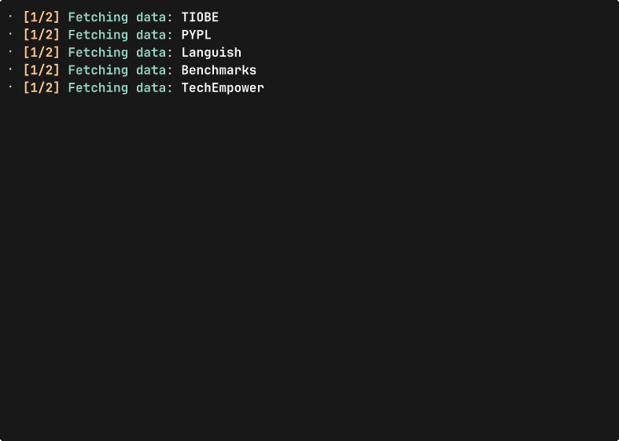

# 🌟 LangRank

[🇺🇸 English](./README.md) · [🇷🇺 Русский](./README.ru.md)

[](https://github.com/hexqnt/langrank/actions/workflows/ci.yml)
[](https://github.com/hexqnt/langrank/actions/workflows/deploy.yml)

LangRank — консольная утилита, которая объединяет данные о популярности и
производительности языков программирования в единый рейтинг по методу Шульце.

[Посмотреть свежий отчёт](https://langrank.hexq.ru/) ·
[Скачать LangRank](https://github.com/hexqnt/langrank/releases/latest)



## Установка

### Готовые бинарники

Скачайте архив для своей системы из
[последнего релиза на GitHub](https://github.com/hexqnt/langrank/releases/latest):

| Система                          | Файл релиза                         |
| -------------------------------- | ----------------------------------- |
| Linux x86_64                     | `langrank-linux-x86_64-gnu.tar.gz`  |
| Linux x86_64, статическая сборка | `langrank-linux-x86_64-musl.tar.gz` |
| Windows x86_64                   | `langrank-windows-x86_64-msvc.zip`  |
| macOS на Apple Silicon           | `langrank-macos-aarch64.tar.gz`     |

В Linux или macOS распакуйте архив и установите бинарник для текущего пользователя:

```bash
tar -xzf langrank-<platform>.tar.gz
mkdir -p ~/.local/bin
install -m 755 langrank ~/.local/bin/langrank
```

Убедитесь, что `~/.local/bin` входит в `PATH`, и проверьте установку:

```bash
langrank --version
```

В Windows распакуйте архив через Проводник или PowerShell:

```powershell
Expand-Archive .\langrank-windows-x86_64-msvc.zip -DestinationPath .\langrank
.\langrank\langrank.exe --version
```

Чтобы запускать команду `langrank` из любого терминала, переместите
`langrank.exe` в постоянную папку и добавьте её в `PATH`.

### Из исходников

Установите [Rust](https://rustup.rs/) и Git, затем соберите и установите актуальную
версию с GitHub через Cargo:

```bash
cargo install --git https://github.com/hexqnt/langrank.git --locked
langrank --version
```

По умолчанию Cargo устанавливает бинарник в `~/.cargo/bin`.

## Использование

Без дополнительных параметров LangRank загружает свежие данные и выводит топ-10:

```bash
langrank
```

Во время загрузки данных программе требуется подключение к интернету.

Чтобы показать полный рейтинг или посмотреть все параметры:

```bash
langrank --full-output
langrank --help
```

### Сохранение данных и отчётов

Путь после флага можно не указывать — тогда LangRank использует значение по
умолчанию, указанное в `langrank --help`.

```bash
# Сохранить объединённые исходные данные и итоговый рейтинг в CSV
langrank --save-rankings --save-schulze

# Сохранить полный HTML-отчёт по указанному пути
langrank --save-html report.html --full-output

# Сжать сохранённые CSV-файлы в архивы .gz
langrank --save-rankings --save-schulze --archive-csv
```

По умолчанию HTML минифицируется. Флаг `--no-minify-html` сохраняет исходный код
отчёта в читаемом виде.

### Автодополнение команд

```bash
# Установить автодополнение Bash для текущего пользователя
langrank completions bash --install

# Вывести скрипт автодополнения fish в stdout
langrank completions fish
```

## Как строится рейтинг

LangRank рассматривает TIOBE, PYPL, Languish и сводный показатель
производительности как четыре набора предпочтений. Показатель производительности
объединяет относительные результаты Benchmarks Game и лучший результат фреймворка
TechEmpower для каждого языка. Метод Шульце формирует итоговый порядок, а при
равенстве используется общий показатель популярности и производительности.

Если части данных о производительности нет, в таблице отображается `-`, а
соответствующий компонент учитывается как нулевой.

## Использование как библиотеки

Репозиторий также предоставляет Rust-библиотеку для загрузки нормализованных
рейтингов. Если зависимости CLI и генерации отчётов не нужны, отключите стандартный
набор возможностей:

```toml
[dependencies]
langrank = { git = "https://github.com/hexqnt/langrank.git", default-features = false }
```

Основная точка входа — `langrank::Fetcher`. Для более точного управления доступны
и отдельные функции загрузки источников.

## Источники данных

- [TIOBE Index](https://www.tiobe.com/tiobe-index/)
- [PYPL Popularity of Programming Language](https://pypl.github.io/PYPL.html)
- [Languish](https://tjpalmer.github.io/languish/)
- [The Computer Language Benchmarks Game](https://benchmarksgame-team.pages.debian.net/benchmarksgame/)
- [TechEmpower Framework Benchmarks](https://www.techempower.com/benchmarks/)
